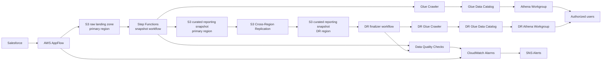

# CRM-DR: Salesforce Disaster-Recovery Reporting on AWS

!!! note "Sanitized case study"
    This is a public engineering case study. Internal account identifiers, repository links, bucket names, ARNs, object lists, and business-sensitive details are intentionally omitted.

## Summary

CRM-DR is a Salesforce disaster-recovery reporting system I designed and built to provide queryable business data during a Salesforce outage.

The system exports core Salesforce objects into AWS every day, publishes a curated reporting snapshot, replicates that snapshot to a disaster-recovery region, validates that the replicated copy is complete and query-ready, and alerts operators if any stage fails or drifts from the expected daily backup.

The result is a low-cost reporting-continuity layer that gives authorized users a documented way to query recent Salesforce-derived business data from AWS, even during a major Salesforce availability incident.

## Problem

The company already had a Salesforce backup and restore path, but backup alone did not solve the full continuity problem.

In a major Salesforce outage, the business needed more than stored copies of records. Users needed a practical way to answer normal reporting questions while Salesforce was unavailable:

- Which accounts, opportunities, cases, tasks, and events are current?
- Which activity records belong to which accounts or contacts?
- How can users query recent business data without waiting for a full Salesforce restoration?
- How can the company verify that the backup is fresh, complete, and usable before an outage occurs?

The original disaster-recovery posture could restore data into a new Salesforce org, but it did not provide an outage-time reporting layer. That created a gap between “we have backups” and “the business can keep operating.”

CRM-DR was built to close that gap.

## Requirements

The system needed to meet several practical requirements:

| Requirement | Why it mattered |
| --- | --- |
| Daily Salesforce export | Reporting data needed to be recent enough to support business continuity. |
| Separation between raw ingestion and reporting data | Partial or failed exports should not corrupt the queryable dataset. |
| Queryable reporting layer | Users needed a way to run familiar business reports outside Salesforce. |
| Cross-region disaster recovery | Reporting continuity should not depend on a single AWS region. |
| Automatic schema handling | Salesforce object changes, new fields, and migrations should not require constant manual intervention. |
| Validation and monitoring | The system needed to prove that the latest copy was fresh, complete, and query-ready. |
| Low operating cost | The system would run continuously but only see heavy query usage during an outage. |
| Clear access model and documentation | Non-engineers needed a pre-documented path for using the system during an incident. |

## High-level design

CRM-DR uses AWS as an external reporting-continuity layer for Salesforce data.

At a high level, the system has five stages:

1. **Ingestion** — export selected Salesforce objects into a raw S3 landing zone.
2. **Snapshot publication** — build the authoritative daily reporting snapshot from successful raw exports.
3. **Catalog and query layer** — expose the latest successful snapshot through Glue and Athena.
4. **Disaster-recovery replication** — replicate the curated snapshot to a second AWS region.
5. **Validation and monitoring** — verify freshness, completeness, catalog state, and query readiness.

The key design principle is that raw ingestion and reporting publication are separate. A failed or partial Salesforce export should not automatically become the dataset users query. Instead, the system only publishes a new reporting snapshot after the expected inputs are present and the snapshot workflow succeeds.

## Architecture

## Key capabilities

- Daily Salesforce object export into AWS
- Curated reporting snapshots separated from raw ingestion output
- Athena-queryable reporting layer
- Cross-region replication for disaster recovery
- Data quality checks for freshness, partition alignment, and consistency
- CloudWatch alarms and SNS notifications for failed or stale runs
- Customer-managed encryption for data at rest
- Documentation and access model for outage-time reporting use

## Reporting layer

CRM-DR includes derived Athena surfaces that emulate Salesforce reporting behavior that does not exist directly in SQL.

Examples include:

- polymorphic `Who`, `What`, and `Owner` lookup resolution
- `TYPEOF`-style reporting columns
- unified Task/Event activity reporting
- account-level activity summary reporting
- supported SOQL date literal translation

## Case study sections to be completed

The final writeup will cover:

1. Problem and business context
2. Requirements
3. Architecture
4. Ingestion design
5. Snapshot publication
6. Cross-region disaster recovery
7. Athena reporting model
8. SOQL-emulation layer
9. Monitoring and validation
10. Cost and operational tradeoffs
11. Result
12. Lessons learned