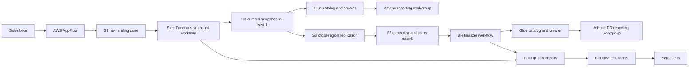

# CRM-DR: Salesforce disaster-recovery reporting on AWS

!!! note "Draft placeholder"
    This page will become the first polished case study. The final version should be sanitized for public viewing and should not include internal AWS account IDs, bucket names, ARNs, repository links, employee names, or screenshots of internal systems.

## Summary

CRM-DR is an AWS-based disaster-recovery reporting system for Salesforce data. It creates a daily queryable copy of core Salesforce objects, publishes curated reporting snapshots, replicates the reporting layer to a second region, validates freshness and consistency, and exposes Athena tables that recreate key Salesforce reporting behaviors during an outage.

## Planned sections

- Context
- Requirements
- Architecture
- Data flow
- Key design decisions
- SOQL-emulation reporting layer
- Reliability and monitoring
- Security and access control
- Cost profile
- Results
- Lessons learned

## Architecture draft

