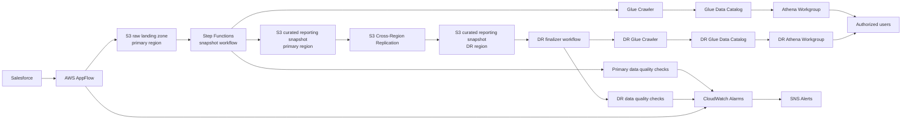

# CRM-DR: Salesforce Disaster-Recovery Reporting on AWS

## Summary

CRM-DR is a Salesforce disaster-recovery reporting system I designed and built to provide queryable business data during a Salesforce outage.

The system exports core Salesforce objects into AWS every day, publishes a curated reporting snapshot, replicates that snapshot to a disaster-recovery region, validates that the replicated copy is complete and query-ready, and alerts the maintainer if any stage fails or drifts from the expected daily backup.

The system gives authorized users a documented way to query recent Salesforce-derived business data from AWS during a major Salesforce availability incident.

## At a glance

| Area | Details |
| --- | --- |
| Role | Designed and built the system end to end |
| Problem | Salesforce backups existed, but there was no practical reporting-continuity layer during an outage |
| Scale | Daily export of core Salesforce objects into AWS |
| Architecture | AppFlow, S3, Step Functions, Glue, Athena, Lambda, CloudWatch, SNS, KMS, cross-region replication |
| Reliability model | Publish-only-on-success snapshots with validation, marker state, and DR-readiness checks |
| Reporting model | Athena tables plus derived SOQL-emulation surfaces for common Salesforce reporting patterns |
| Cost profile | Under $25/month baseline cost under normal usage; heavier Athena usage only expected during an outage or periodic testing |

## What I owned

I designed and built the system end to end: AWS architecture, Terraform-managed infrastructure, ingestion workflow, snapshot publication logic, DR replication/finalization model, Athena reporting layer, validation checks, monitoring, access model, and internal documentation.

## Problem

The company already had a Salesforce backup and restore path, but backup alone did not solve the full continuity problem.

In a major Salesforce outage, the business needed more than stored copies of records. Users needed a practical way to answer normal reporting questions while Salesforce was unavailable:

- Which accounts, opportunities, cases, tasks, and events are current?
- Which activity records belong to which accounts or contacts?
- How can users query recent business data without waiting for a full Salesforce restoration?
- How can the company verify that the backup is fresh, complete, and usable before an outage occurs?

The original disaster-recovery posture could restore data into a new Salesforce org, but it did not provide an outage-time reporting layer. That created a gap between “we have backups” and “the business can keep operating.”

CRM-DR was built to close that gap.

## Requirements

The system needed to meet several practical requirements:

| Requirement | Why it mattered |
| --- | --- |
| Daily Salesforce export | Reporting data needed to be recent enough to support business continuity. |
| Separation between raw ingestion and reporting data | Partial or failed exports should not corrupt the queryable dataset. |
| Queryable reporting layer | Users needed a way to run familiar business reports outside Salesforce. |
| Cross-region disaster recovery | Reporting continuity should not depend on a single AWS region. |
| Automatic schema handling | Field-level schema changes for configured Salesforce objects should not require constant manual intervention. |
| Validation and monitoring | The system needed to prove that the latest copy was fresh, complete, and query-ready. |
| Low operating cost | The system would run continuously but only see heavy query usage during an outage. |
| Clear access model and documentation | Non-engineers needed a pre-documented path for using the system during an incident. |

## High-level design

CRM-DR uses AWS as an external reporting-continuity layer for Salesforce data.

At a high level, the system has five stages:

1. **Ingestion** — export selected Salesforce objects into a raw S3 landing zone.
2. **Snapshot publication** — build the authoritative daily reporting snapshot from successful raw exports.
3. **Catalog and query layer** — expose the latest successful snapshot through Glue and Athena.
4. **Disaster-recovery replication** — replicate the curated snapshot to a second AWS region.
5. **Validation and monitoring** — verify freshness, completeness, catalog state, and query readiness.

Raw ingestion and reporting publication stay separate. A failed or partial Salesforce export should not become the dataset users query. The system publishes a new reporting snapshot only after the expected inputs are present and the snapshot workflow succeeds.

## Architecture

## Architecture walkthrough

CRM-DR is organized around a publish-only-on-success model.

The system does not allow raw Salesforce exports to directly become the reporting dataset. Instead, each daily run first lands source data in a raw ingestion area. A separate snapshot workflow then decides whether the expected inputs are available and safe to publish as the latest reporting snapshot.

That separation protects the query surface. A partial export, failed upstream job, or stale partition gets caught before users rely on it during an outage.

The architecture has two region-local reporting environments:

- the primary region, where Salesforce data is ingested and the authoritative daily snapshot is built
- the disaster-recovery region, where the curated snapshot is replicated, reconciled, cataloged, and validated

The DR region does not rerun Salesforce ingestion. It receives the curated reporting snapshot from the primary region and then independently verifies that the replicated copy is complete and query-ready.

## Ingestion

Salesforce data is exported into AWS using scheduled AppFlow jobs.

Each configured Salesforce object is exported as object-scoped Parquet output into a raw S3 landing zone. The raw landing zone is intentionally separate from the curated reporting layer. That gives the workflow room to detect ingestion failures, partial exports, or object-level issues before they affect the dataset users query.

The ingestion layer is responsible for:

- exporting selected Salesforce objects on a daily schedule
- writing source data into raw S3 prefixes
- keeping object outputs isolated from one another
- surfacing AppFlow failures or deactivation events through monitoring
- providing the source material for the daily snapshot workflow

The latest known-good snapshot remains available when a raw export fails.

## Snapshot publication

The snapshot workflow builds the authoritative daily reporting dataset.

A scheduled Step Functions workflow coordinates the publication path. Its job is to determine whether the expected raw exports are available for the target run date, select the correct source outputs, handle objects that legitimately produced zero rows, publish curated snapshot data, refresh catalog metadata, and write success or failure markers for the run.

The snapshot workflow is responsible for:

- preventing overlapping daily publication runs
- waiting for expected upstream exports
- selecting the correct raw source executions for the target date
- copying valid source files into curated reporting prefixes
- preserving consistent output shape for zero-row objects
- triggering Glue catalog refresh
- writing marker state that defines the latest successful snapshot

Only a successful snapshot run advances the reporting dataset. If ingestion, catalog refresh, or validation fails, the system keeps exposing the last known-good snapshot.

## Catalog and query layer

The curated snapshot is exposed through Glue and Athena.

S3 stores the published reporting data. Glue maintains the catalog metadata and partitions. Athena provides the query interface for both normal validation checks and outage-time reporting by authorized users.

This layer is designed to be operationally simple and low cost. The system runs continuously, but heavy query usage is only expected during a Salesforce incident or during occasional validation/testing. Athena fits this use case better than a continuously running database dedicated to disaster-recovery reporting.

The query layer includes:

- curated S3 snapshot data
- Glue database, tables, and partitions
- Athena workgroup for reporting queries
- Athena result storage
- customer-managed encryption for data at rest
- IAM-controlled access for authorized users
- documentation for outage-time use

The reporting layer also includes derived Athena tables that recreate Salesforce reporting behavior that does not exist natively in SQL. Those derived surfaces are covered separately in the SOQL-emulation section.

## Cross-region disaster recovery

CRM-DR is designed so reporting continuity does not depend on a single AWS region.

After the primary-region snapshot workflow publishes the curated reporting dataset, S3 cross-region replication moves the curated snapshot and supporting marker state to the disaster-recovery region. The DR region does not rerun Salesforce ingestion. Instead, it receives the already-curated reporting snapshot and performs its own readiness checks before exposing the replicated copy as DR-ready.

Replication puts files in the second region. The finalizer proves the DR reporting environment is usable.

The DR finalization workflow verifies that the replicated dataset matches the expected snapshot contract before marking it ready. That includes checking object presence, file counts, key-set consistency, catalog state, and marker state.

The DR layer is responsible for:

- receiving curated snapshot data from the primary region
- preserving the same dataset shape in the DR region
- verifying that the replicated object set matches the primary snapshot
- reconciling zero-row objects so catalog shape remains consistent
- refreshing the DR Glue catalog
- writing a DR-ready marker only after validation succeeds

The system treats replicated files as usable only after the DR-specific finalization and validation steps complete.

## Validation and monitoring

A disaster-recovery reporting system needs to be fresh, complete, and query-ready before an outage occurs.

CRM-DR includes scheduled Lambda-based validation checks that inspect the latest published state in each region. These checks are designed to catch problems where infrastructure technically ran, but the reporting layer is stale, incomplete, miscataloged, or logically inconsistent.

The validation layer checks for:

- latest-success markers matching the expected run date
- Glue partitions aligned with the latest successful snapshot
- expected tables being queryable in Athena
- row-count consistency between base and derived reporting tables
- cross-region consistency between primary and DR reporting surfaces
- internal consistency of derived activity summary tables

Monitoring is built around CloudWatch alarms and SNS notifications. Alarms are configured around the pipeline stages where failure would affect reporting readiness, including ingestion, snapshot publication, DR finalization, data quality checks, and stale or missing daily executions.

The monitoring layer tracks:

- AppFlow failures or deactivation events
- Step Functions execution failures
- Lambda errors
- dead-letter queue depth
- stale or missing daily run markers
- data quality validation failures

The alerts should make the failure location obvious: upstream Salesforce ingestion, primary snapshot publication, cross-region replication, DR finalization, catalog refresh, or data-quality validation.

## SOQL-emulation reporting layer

A major challenge was that Salesforce reporting behavior does not map directly to base SQL tables.

Salesforce users and reports often rely on relationship behavior that is natural in SOQL but absent from raw Athena queries. In particular, Salesforce activity objects use polymorphic relationships such as `WhoId`, `WhatId`, and `OwnerId`, where the same field can point to different object types depending on the record.

For outage-time reporting, raw Salesforce object exports alone would not support the reports users were used to. Users needed reporting surfaces that preserved common Salesforce-style access patterns.

CRM-DR publishes derived Athena tables that emulate the specific SOQL behaviors needed for reporting continuity.

### Polymorphic lookup resolution

Salesforce Tasks and Events can point to different object types through the same relationship field.

CRM-DR resolves those relationships ahead of time into enriched reporting tables, including:

- `task_enriched`
- `event_enriched`
- `activity_enriched`

These tables expose fields such as:

- `what_type`
- `what_name`
- `who_type`
- `who_name`
- `owner_type`
- `owner_name`

Users can query activity records with Salesforce-like relationship context without manually joining every possible target object.

For example, instead of trying to recreate `What.Name` or `Who.Name` dynamically during an incident, users can query precomputed columns in Athena.

### TYPEOF-style reporting

Salesforce `TYPEOF` queries allow different fields to be selected depending on the runtime type of a polymorphic relationship.

CRM-DR emulates this through type-specific derived columns in tables such as:

- `task_typeof`
- `event_typeof`

Example output columns include:

- `what_account_name`
- `what_campaign_name`
- `what_opportunity_name`
- `what_case_number`
- `who_contact_name`
- `who_lead_name`
- `owner_user_name`

Those columns give Athena a practical equivalent for common reporting cases where users need type-specific fields from polymorphic Salesforce relationships.

### Activity summary reporting

Some Salesforce reports depend on child-relationship behavior, such as summarizing related activities for an account.

CRM-DR does not attempt to implement arbitrary nested SOQL subqueries. Instead, it implements the specific account activity summary behavior needed for continuity reporting through a derived table:

- `account_activity_summary`

This table includes fields such as:

- task count
- event count
- total activity count
- most recent task date
- most recent event date
- most recent activity date

That scope keeps the system tied to continuity reporting instead of trying to recreate the entire Salesforce query engine.

### Date literal translation

Salesforce supports date literals such as `TODAY`, `YESTERDAY`, `THIS_WEEK`, `LAST_MONTH`, and `THIS_YEAR`.

CRM-DR includes support for translating common Salesforce date literals into Athena-compatible date predicates. That preserves familiar reporting patterns while still using standard SQL execution in Athena.

## Design tradeoffs

CRM-DR intentionally favors reliability, simplicity, and low operating cost over low-latency synchronization.

The system uses daily reporting snapshots rather than real-time replication. During a Salesforce outage, the business needs recent and trustworthy reporting data. Sub-minute replication is outside the continuity scope.

Key tradeoffs included:

| Decision | Tradeoff |
| --- | --- |
| Daily snapshots instead of real-time sync | Lower cost and simpler operations, but data is only current to the latest successful run. |
| Athena instead of a continuously running database | Very low baseline cost and simple query access, but query performance depends on Athena usage patterns and data layout. |
| Derived reporting tables instead of full SOQL compatibility | Covers the reporting behavior the business needs without attempting to rebuild Salesforce. |
| Publish-only-on-success snapshots | Protects users from partial data, but requires marker state and validation logic. |
| DR finalization after replication | Adds another workflow, but prevents treating merely replicated files as query-ready reporting data. |

## Cost model

CRM-DR keeps baseline cost low because it is a continuity system with bursty usage.

Most of the system’s cost comes from scheduled data movement, storage, catalog operations, validation checks, and occasional Athena queries. Heavy query usage is only expected during a Salesforce outage or during periodic testing.

The main cost-control decisions were:

- using S3 as the durable storage layer
- using Athena for query-on-demand reporting instead of a continuously running database
- running scheduled workflows only when needed
- separating raw and curated data with lifecycle controls
- keeping validation targeted instead of running broad expensive scans
- using serverless or managed AWS services where possible

Baseline operating cost is under $25/month under normal conditions. During an actual outage, Athena query usage would increase, but that cost increase would be temporary and tied directly to the business-continuity event the system exists to support.

## Result

CRM-DR closed the gap between “Salesforce data is backed up” and “the business can continue reporting during a Salesforce outage.”

The final system provides:

- daily Salesforce-derived reporting snapshots
- separation between raw ingestion and latest known-good reporting data
- Athena-queryable access to core business records
- cross-region replicated disaster-recovery reporting data
- DR-specific readiness validation before the replicated copy is treated as usable
- monitoring and alerts for failed, stale, or inconsistent runs
- derived reporting tables that preserve common Salesforce/SOQL reporting behavior
- documented access patterns for authorized users during an outage
- low baseline operating cost

Main outcome: operational confidence. The system stores exported data and checks that the latest reporting state is fresh, complete, cataloged, queryable, and available from a second region before declaring it ready.

## What I learned

This project made the DR requirement concrete:

A backup is only useful if the organization can answer practical questions under failure conditions:

- Is the latest copy fresh?
- Is it complete?
- Is it queryable?
- Can the right users access it?
- Does the data preserve the business semantics people rely on?
- Will maintainers know when something is stale, missing, or broken?

Exporting Salesforce data was the easy part. The harder problem was turning exported data into a trustworthy reporting-continuity layer with validation, schema handling, access control, cross-region readiness, and enough Salesforce-like behavior to support real business workflows.

Engineering takeaways:

- Raw backups and user-facing reporting datasets should be separated.
- A system should not advance its “latest successful” state unless publication succeeds end to end.
- Replicated files are not the same thing as a validated DR-ready reporting environment.
- Low-cost serverless designs work well when usage is bursty and incident-driven.
- Recreating a small, high-value subset of Salesforce reporting behavior is more practical than trying to clone Salesforce itself.
- Documentation and access design have to ship with the system.

## Future improvements

The current system is intentionally scoped around daily reporting continuity. Future improvements could include:

- expanding the supported object set as business requirements change
- adding more saved Athena queries for common outage-time workflows
- improving user-facing documentation with more examples for non-engineers
- adding periodic DR exercises to validate the full access and reporting process
- expanding derived reporting surfaces if additional Salesforce reporting patterns become critical

The architecture should stay simple, low-cost, validated, and tied to the continuity workflows the business actually needs.