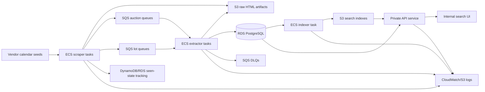

# LOTUS: Large-Scale Auction Ingestion and Search Platform

!!! note "Case study in progress"
    This is a public, sanitized engineering case study. Internal identifiers, vendor lists, account IDs, repository links, ARNs, database details, and business-sensitive implementation details are intentionally omitted.

## Summary

LOTUS is an AWS-hosted auction ingestion and search platform designed to help an internal buying team discover and search upcoming auction lots from global auction sources.

The system discovers auction calendar pages, crawls auction and lot pages, stores raw source artifacts, extracts structured auction and lot data, persists normalized records, builds searchable indexes, and exposes search through an internal application.

The project is designed around high-volume ingestion, duplicate avoidance, structured extraction, cost-aware AWS infrastructure, and operational visibility.

## At a glance

| Area | Details |
| --- | --- |
| Role | Designed and built the system architecture and core infrastructure |
| Problem | Auction sourcing required broad discovery and searchable access to large volumes of external lot data |
| Scale | 50,000+ active lots, with 20,000+ new lots processed weekly |
| Architecture | ECS/Fargate, SQS, S3, RDS PostgreSQL, DynamoDB, Terraform, GitHub Actions, API/UI, search indexing |
| Reliability model | Queue-based processing, raw artifact retention, duplicate tracking, DLQs, logs, health checks, and scheduled workflows |
| User surface | Internal search UI/API for buying-team access |
| Status | Production-oriented MVP in active development |

## Problem

The buying workflow depends on finding relevant high-value items across many external auction sources.

Manual discovery does not scale well across auction houses, calendar pages, auction detail pages, lot pages, and constantly changing upcoming-sale inventory. The business needed a broader and more durable way to maintain visibility into upcoming auction lots, search them, and avoid repeatedly rediscovering the same items.

LOTUS was built to turn scattered external auction data into a continuously refreshed internal search surface.

## Requirements

| Requirement | Why it mattered |
| --- | --- |
| Broad auction discovery | The system needed to discover auctions and lots across many external sources. |
| High-volume ingestion | The platform needed to handle tens of thousands of active lots and thousands of new weekly records. |
| Duplicate avoidance | Repeated crawls should refresh known records without creating duplicate auctions or lots. |
| Raw artifact storage | Source HTML needed to be retained for extraction, debugging, and reproducibility. |
| Structured extraction | Auction and lot pages needed to become normalized database records. |
| Searchable access | Business users needed a practical way to query the current lot universe. |
| Cost-aware infrastructure | The system needed to run economically while supporting bursty ingestion workloads. |
| Operational visibility | Failures needed to be diagnosable across crawling, extraction, queueing, storage, and indexing. |

## What I owned

I designed and implemented the core system architecture, Terraform-managed AWS infrastructure, scraper/extractor/indexer/API/UI deployment path, queue design, database integration, logging/monitoring approach, and operational debugging workflow.

## High-level architecture

## Case study sections to be completed

The final writeup will cover:

1. Business problem and sourcing workflow
2. Requirements and constraints
3. Architecture
4. Scraper design
5. Queueing and handoff model
6. Raw artifact storage
7. Structured extraction
8. Database model and duplicate tracking
9. Search indexing
10. API/UI access
11. Infrastructure and deployment
12. Monitoring, failures, and operational debugging
13. Cost and reliability tradeoffs
14. Result
15. Lessons learned
