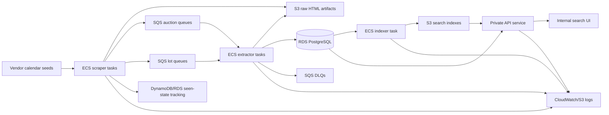

# LOTUS: Large-Scale Auction Ingestion and Search Platform

!!! note "Case study in progress"
    This is a public, sanitized engineering case study. Internal identifiers, vendor lists, account IDs, repository links, ARNs, database details, and business-sensitive implementation details are intentionally omitted.

## Summary

LOTUS is an AWS-hosted auction ingestion and search platform designed to help an internal buying team discover and search upcoming auction lots from global auction sources.

The system discovers auction calendar pages, crawls auction and lot pages, stores raw source artifacts, extracts structured auction and lot data, persists normalized records, builds searchable indexes, and exposes search through an internal application.

The project is designed around high-volume ingestion, duplicate avoidance, structured extraction, cost-aware AWS infrastructure, and operational visibility.

## At a glance

| Area | Details |
| --- | --- |
| Role | Designed and built the system architecture and core infrastructure |
| Problem | Auction sourcing required broad discovery and searchable access to large volumes of external lot data |
| Scale | 50,000+ active lots, with 20,000+ new lots processed weekly |
| Architecture | ECS/Fargate, SQS, S3, RDS PostgreSQL, DynamoDB, Terraform, GitHub Actions, API/UI, search indexing |
| Reliability model | Queue-based processing, raw artifact retention, duplicate tracking, DLQs, logs, health checks, and scheduled workflows |
| User surface | Internal API/UI for buying-team search access, still being hardened |
| Status | Active MVP with working ingestion, extraction, indexing, and internal search paths |

## Problem

The buying workflow depends on finding relevant high-value items across many external auction sources.

Manual discovery does not scale well across auction houses, calendar pages, auction detail pages, lot pages, and constantly changing upcoming-sale inventory. The business needed a broader and more durable way to maintain visibility into upcoming auction lots, search them, and avoid repeatedly rediscovering the same items.

LOTUS was built to turn scattered external auction data into a refreshable internal search surface.

## Requirements

| Requirement | Why it mattered |
| --- | --- |
| Broad auction discovery | The system needed to discover auctions and lots across many external sources. |
| High-volume ingestion | The platform needed to handle tens of thousands of active lots and thousands of new weekly records. |
| Duplicate avoidance | Repeated crawls should refresh known records without creating duplicate auctions or lots. |
| Raw artifact storage | Source HTML needed to be retained for extraction, debugging, and reproducibility. |
| Structured extraction | Auction and lot pages needed to become normalized database records. |
| Searchable access | Business users needed a practical way to query the current lot universe. |
| Cost-aware infrastructure | The system needed to run economically while supporting bursty ingestion workloads. |
| Operational visibility | Failures needed to be diagnosable across crawling, extraction, queueing, storage, and indexing. |

## What I owned

I designed and implemented the core system architecture, Terraform-managed AWS infrastructure, scraper/extractor/indexer/API/UI deployment path, queue design, database integration, logging/monitoring approach, and operational debugging workflow.

## High-level architecture

## Architecture walkthrough

LOTUS is organized as a multi-stage ingestion and search system rather than a single scraper.

The system separates discovery, raw artifact storage, structured extraction, database persistence, indexing, and user-facing search. That separation matters because external auction sites are inconsistent, change frequently, and fail in different ways. A failed extraction should not erase the source artifact. A repeated crawl should refresh known records rather than duplicate them. A search index should be rebuildable from persisted structured data.

The architecture uses a queue-based handoff between stages:

1. **Discovery and crawling** find auction and lot pages from configured vendor calendar sources.
2. **Raw artifact storage** saves source HTML for extraction, debugging, and reproducibility.
3. **Queue handoff** sends auction and lot work items to extractor queues.
4. **Structured extraction** turns auction and lot pages into normalized records.
5. **Persistence** stores extracted data in PostgreSQL and updates seen-state tracking.
6. **Indexing** builds search artifacts from the database.
7. **API/UI access** provides a controlled path for internal users to search the indexed lot universe.

The core design choice is that each stage should have a clear contract. The scraper does not need to know how search works. The indexer does not need to know how a vendor page was crawled. The API does not need to re-run extraction. This keeps the platform debuggable as volume and vendor coverage grow.

## Discovery and crawling

LOTUS starts from configured auction calendar sources.

For each source, the scraper discovers auction pages and then discovers lot pages from those auctions. The scraper is responsible for fetching source pages, writing raw HTML artifacts, identifying canonical URLs, and producing queue messages for downstream extraction.

This stage has to handle a messy external environment:

- vendor sites with different calendar structures
- inconsistent auction page layouts
- lot pages with variable metadata quality
- repeated appearances of the same auction or lot across runs
- pages that disappear, change, redirect, or fail intermittently
- high-volume crawls where failures need to be isolated rather than fatal to the whole run

The crawler therefore treats discovery as an incremental process. It records what it sees, refreshes known items when they reappear, and avoids treating every crawl as a clean one-time import.

## Duplicate tracking and seen-state

Duplicate avoidance is one of the central requirements.

Auction and lot pages are rediscovered across scheduled runs, vendor pages, and retry paths. LOTUS needs to distinguish between a genuinely new lot, a known lot that is still active, and a previously seen item whose metadata should be refreshed.

The system uses persistent seen-state tracking so crawls can update first-seen and last-seen information without repeatedly creating duplicate records. This also supports downstream extraction decisions: known lots can be skipped, refreshed, or reprocessed depending on the state of the record and the needs of the run.

The important design principle is that duplicate tracking is not just a performance optimization. It is part of the data model. Without it, the database and search index would accumulate repeated versions of the same external lot, making search results less useful for the buying team.

## Raw artifact storage

LOTUS stores source HTML separately from structured database records.

This is a deliberate reliability choice. External auction pages are the evidence behind every extracted record. Keeping raw artifacts makes it possible to debug extraction failures, inspect vendor-specific layout changes, replay problematic pages, and separate crawling issues from extraction issues.

Raw artifact storage also makes the pipeline more resilient. If a page was successfully crawled but extraction failed later, the system does not necessarily need to re-fetch the external page to debug or retry the extraction. The saved source artifact can be used as the stable input for downstream processing.

This is especially important for auction data because external pages are time-sensitive. A lot page may change, disappear, or become unavailable after the auction closes.

## Queueing and handoff model

LOTUS uses SQS queues to decouple crawling from extraction.

The scraper emits queue messages after writing raw artifacts and identifying the work that needs to happen next. Extractor workers then consume auction and lot messages independently. This design allows crawling and extraction to scale separately and makes failures easier to isolate.

The queueing layer provides several benefits:

- scraper runs can hand off work without waiting for extraction to finish
- auction and lot extraction can be handled by separate worker modes
- failed messages can be retried without rerunning the entire crawl
- dead-letter queues preserve failed work items for investigation
- worker concurrency can be adjusted based on queue depth and downstream limits

The handoff model also creates a clearer operational boundary. If lots are not appearing in search, the failure can be investigated stage by stage: discovery, raw artifact write, queue message, extraction, database persistence, index build, API access, or UI rendering.

## Structured extraction

The extractor converts raw auction and lot artifacts into structured records.

Auction extraction and lot extraction are treated as related but distinct workflows. Auction records provide parent context such as sale identity, vendor, title, dates, and canonical URLs. Lot records provide item-level details such as title, description, estimates, images, lot numbers, and source references.

The extraction layer has to tolerate inconsistent source pages. Different vendors expose different fields, use different naming conventions, and vary in how much structured information appears on the page. LOTUS therefore treats extraction as a normalization problem: take heterogeneous external pages and produce a consistent internal representation that can be stored, searched, and reviewed.

The most important goal is not perfect extraction from every possible page. The goal is a pipeline that can process large volumes of external auction data, preserve failures for debugging, and improve over time without destabilizing the rest of the system.

## Database and persistence model

PostgreSQL stores the normalized auction and lot records used by the search layer.

The database gives LOTUS a durable source of truth separate from the raw artifacts and search indexes. This makes it possible to refresh records, inspect processing state, rebuild indexes, and query the current lot universe directly when debugging.

The persistence layer tracks both extracted data and operational state, including whether records were discovered, extracted, skipped, failed, refreshed, or deferred because parent data was missing. That state is important because external auction data is relational: lots often depend on auction context, and extraction can fail if an expected parent auction record is not available yet.

By keeping structured records and processing state in the database, LOTUS can support incremental improvement instead of requiring every run to be perfect.

## Search indexing

The indexer builds search artifacts from persisted structured data.

This keeps search separate from ingestion. The scraper and extractor populate the database; the indexer turns the current database state into search-ready artifacts. That separation makes the search layer rebuildable and avoids coupling user-facing search directly to in-flight crawl or extraction work.

The indexing stage is designed around the internal buying workflow: users need practical search access to current auction inventory, not a raw dump of crawled pages. The index therefore depends on normalized records, consistent fields, and enough metadata to make search results useful.

## API and UI access

LOTUS provides an internal API and UI for searching the indexed lot universe.

The API provides a controlled service boundary between the search/index data and the user-facing application. The UI layer gives internal users a practical search surface without requiring direct database or AWS access.

The user-facing layer is intentionally downstream of ingestion, extraction, persistence, and indexing. That keeps the UI focused on discovery and review rather than embedding pipeline logic into the frontend.

## Infrastructure and deployment

LOTUS is deployed on AWS using Terraform-managed infrastructure and GitHub Actions deployment workflows.

The infrastructure is designed around managed services where possible: ECS/Fargate for containerized workers and services, SQS for queueing, S3 for raw artifacts and search outputs, RDS PostgreSQL for structured persistence, DynamoDB for seen-state/cache-style access patterns, and CloudWatch/S3 logs for operational visibility.

This design keeps the system cloud-native without requiring a large operations team. Individual components can be deployed, inspected, scaled, and debugged independently.

## Monitoring and operational debugging

LOTUS needs to be debuggable across multiple asynchronous stages.

A lot can fail to appear in search for many reasons: it may not have been discovered, the source HTML may not have been written, the queue message may not have been produced, extraction may have failed, parent auction context may be missing, database persistence may have failed, or the search index may not have been rebuilt yet.

The system is therefore designed around stage-specific evidence:

- raw source artifacts for page-level debugging
- queue state and DLQs for failed handoffs
- structured processing state in the database
- logs from scraper, extractor, indexer, API, and UI components
- rebuildable search artifacts
- explicit failure/defer states rather than silent drops

This operational model matters because LOTUS depends on unreliable external sources. Debuggability is part of the product, not just an implementation detail.

## Current status

LOTUS is an active MVP with working ingestion, extraction, persistence, indexing, and internal search paths.

The system is still being hardened. Current work focuses on improving extraction quality, queue behavior, search performance, operational visibility, and the handoff between backend services and user-facing search.

The key distinction is that LOTUS is not a one-off scraper. It is a multi-component product-sourcing platform with durable storage, queue-based processing, structured extraction, search indexing, infrastructure as code, and operational debugging paths.

## Design tradeoffs

LOTUS intentionally favors durability and debuggability over maximum scraping speed.

Key tradeoffs include:

| Decision | Tradeoff |
| --- | --- |
| Store raw HTML artifacts | Higher storage volume, but better debugging, replay, and extraction reproducibility. |
| Use queue-based handoff | More moving parts, but better isolation between crawling and extraction. |
| Separate database and search index | Requires indexing workflow, but makes search rebuildable from persisted records. |
| Track seen-state persistently | More state management, but avoids duplicate records and supports incremental refresh. |
| Use managed AWS services | Less low-level control, but faster delivery and lower operational burden. |
| Build an internal search surface before recommendation logic | Less automation at first, but gives users transparent access to source data. |

## Result

LOTUS gives the buying workflow a broader, more durable way to track upcoming auction inventory.

Instead of relying only on manual source checking or isolated vendor searches, the system maintains a refreshable internal dataset of auction lots and exposes that data through a search-oriented workflow.

The system currently demonstrates:

- high-volume auction and lot discovery
- raw artifact preservation
- queue-based extraction handoff
- normalized auction and lot persistence
- duplicate tracking and refresh behavior
- search index generation
- internal API/UI search access
- Terraform-managed AWS infrastructure
- operational visibility through logs, queues, and processing state

## What I learned

LOTUS reinforced that scraping at business scale is less about fetching pages and more about building a resilient data system around unreliable sources.

The hard parts are not just parsing HTML. The hard parts are identity, state, retries, source drift, parent-child relationships, partial failures, searchability, operational debugging, and cost control.

The project also made several engineering lessons clear:

- Raw source artifacts are essential when extraction quality matters.
- Queue boundaries make large pipelines easier to debug.
- Search should be downstream of normalized durable records, not directly tied to crawling.
- Duplicate tracking must be designed into the system early.
- External data systems need explicit failure states, not just success paths.
- Infrastructure and application code have to evolve together when the product spans workers, storage, queues, databases, APIs, and UI.
